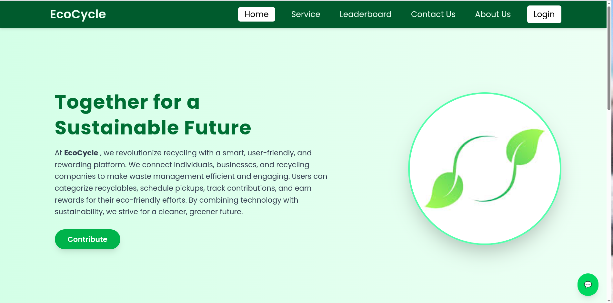
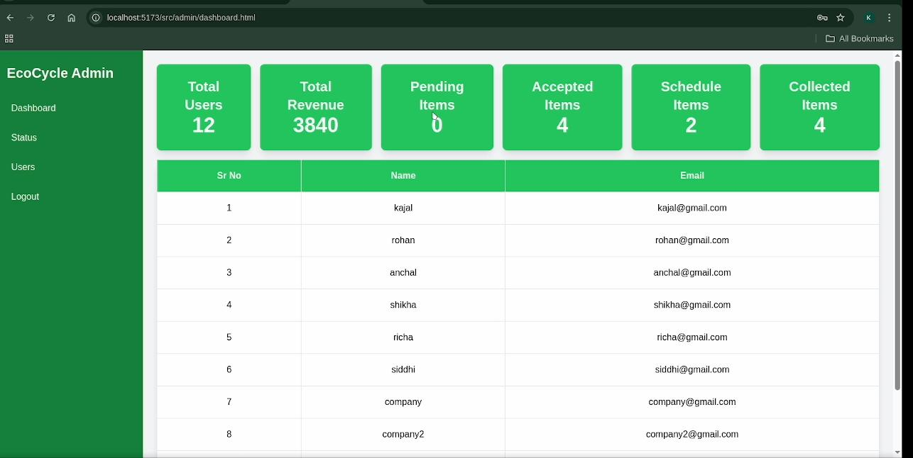
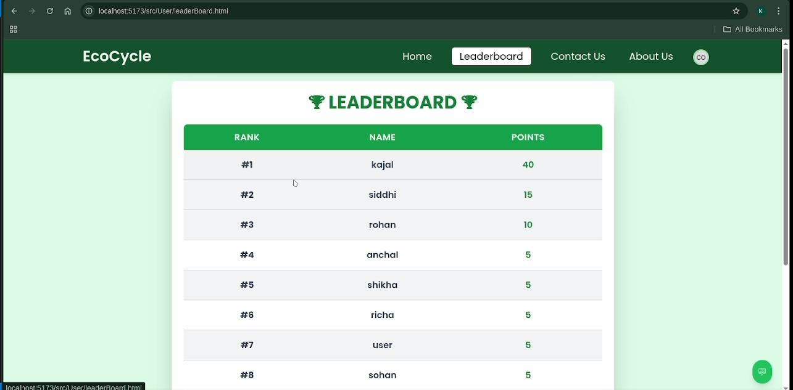
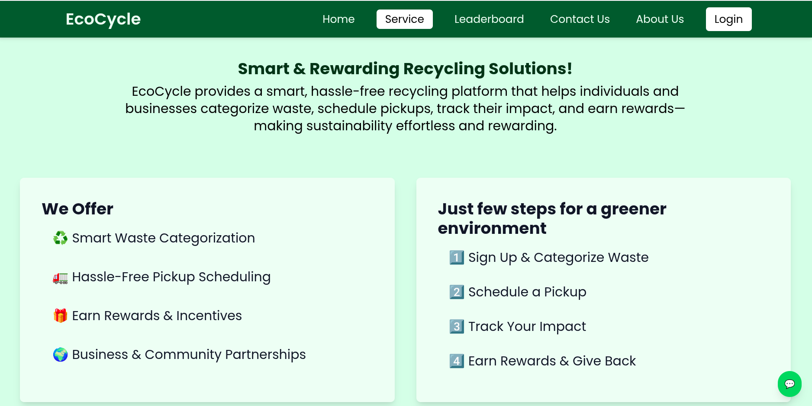
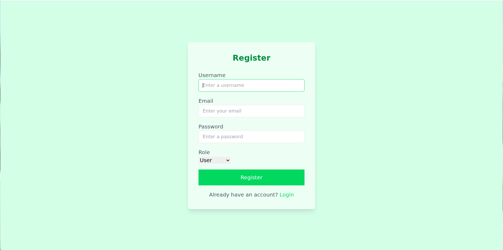

# EcoCycleWeb

EcoCycleWeb is a **role-based smart recycling and waste management platform** designed to promote sustainable living by connecting **users, recycling companies, and administrators** in one unified system.

It enables users to easily submit recyclable items, earn rewards, schedule pickups, and track their contributions to the environment. Recycling companies can efficiently manage collection requests, while admins oversee system activity through analytics and insights.

The platform also includes a **leaderboard system** and an **AI-powered chatbot** to encourage engagement, healthy competition, and eco-friendly habits.

---

## Features

### User Features

- Submit recyclable waste items
- Earn reward points for contributions
- Schedule pickup requests
- Track recycling history
- View leaderboard rankings

### Company Features

- View and manage pickup requests
- Organize and track collections
- Update request status
- Monitor recycling operations

### Admin Features

- Monitor platform activity
- View analytics and system insights
- Manage users and companies
- Ensure smooth platform operations

### Engagement Features

- Real-time leaderboard system
- Reward points system
- AI chatbot for recycling guidance and eco-tips

---

## AI Chatbot

EcoCycleWeb includes an intelligent chatbot that helps users:

- Understand recyclable materials
- Learn eco-friendly practices
- Get guidance on waste segregation
- Improve recycling habits

---

## Screenshots

### Home Page

### Admin Dashboard

### Leaderboard

### Service

### Login

### Register

---
